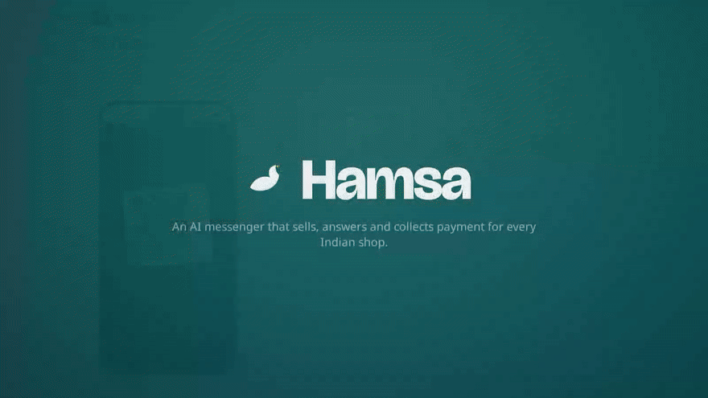

# Hamsa

An Indian messaging app in the WhatsApp mould. Personal and group chats are end-to-end encrypted and free for
everyone. Businesses live inside the same app, where an Indic AI agent takes orders in the customer's language and
collects payment by UPI. Businesses pay on plans from ₹99/month.

<p align="center">
  
</p>

[Play the video](demo/hamsa-demo.mp4).

## What works today

* **Messenger**: phone-number sign-up (OTP), 1:1 and group chats, end-to-end encrypted in the browser
  (WebCrypto). History is kept only on devices, with multi-device fan-out, comparable security codes, typing
  indicators and offline delivery.
* **Shops in chat**: every business gets a link (`/b/sharma-kirana`). Customers can chat without signing up, and
  their chats and orders carry over when they later verify a phone number.
* **AI agent**: understands orders like "2 kg cheeni aur 1 doodh bhejo", "எனக்கு 2 கிலோ சர்க்கரை வேணும்" or
  "2 কেজি চিনি লাগবে". It replies in English, Hindi, Hinglish, Marathi, Tamil, Tanglish, Telugu or Bengali, keeps
  a cart, places orders, answers FAQs and hours, and hands off to the owner. A model server (vLLM/SGLang, OpenAI-compatible)
  is optional. A verifier stops the model from inventing prices.
* **Payments**: UPI intent link + QR straight to the merchant's UPI ID. Hamsa never holds money.
* **Owner dashboard**: orders with status actions and today's sales, inbox with an AI on/off switch per chat, catalog
  editor (aliases in any script, price, stock), FAQ and shop settings.

See [`docs/architecture.md`](docs/architecture.md) for the design, trust boundaries, and how v0.1 maps to the
target stack in the [Phase 0 research memo](docs/phase-0/research-memo.md).

## Run it

Requires Python 3.12, [uv](https://docs.astral.sh/uv/) and Node 22.

```bash
./scripts/dev.sh
```

This seeds a demo shop and starts the API on `:8000` and the web app on `:5173`. Then:

1. Open <http://localhost:5173/b/sharma-kirana> and chat to order as a guest.
2. In a private window, sign in at `/login` as `98000 00001` (the demo shop owner; in development the
   OTP is shown on screen). Open **My business** to see the order and confirm payment.
3. Sign in with another number in a third window and start an encrypted chat from **New chat**.

Configuration (environment variables):

| Variable | Default | Purpose |
|---|---|---|
| `HAMSA_DATABASE_URL` | `sqlite+aiosqlite:///./hamsa.db` | Any SQLAlchemy async URL |
| `HAMSA_JWT_SECRET` | random per process | Session signing key (set it, or sessions end on restart) |
| `HAMSA_DEV_OTP` | `1` | Return OTP in the API response instead of sending SMS |
| `HAMSA_LLM_BASE_URL` | empty (rules only) | OpenAI-compatible endpoint, e.g. `http://gpu:8000/v1` |
| `HAMSA_LLM_MODEL` | `sarvamai/sarvam-30b` | Model name sent to that endpoint |
| `HAMSA_CORS_ORIGINS` | `http://localhost:5173` | Comma-separated origins |

## Tests

```bash
cd services/api && uv venv .venv && uv pip install -r requirements-dev.txt && .venv/bin/python -m pytest -q
cd apps/web && npm install && npm test && npm run build
```

The backend tests (66) cover OTP limits, the age gate, the encrypted relay and device-set enforcement, groups, call signalling,
the full Hinglish/Tamil/Hindi ordering flow through UPI and owner confirmation, stock reservation, handoff, guest
merge, and the LLM tier against a fake model (tool use, invented-price rejection, outage fallback). The web tests
cover encryption round-trip, tamper/replay rejection, non-extractable keys and security codes.

## Layout

```
services/api/      FastAPI backend: auth, E2EE relay, realtime, business agent, orders, UPI
apps/web/          React web app: messenger, shop page, owner dashboard
docs/              Architecture (as built) and the Phase 0 research memo
research/phase0/   Tokenizer fertility harness and unit-economics model
scripts/dev.sh     One-command local run
```

## Not built yet

Native Android/iOS apps (needed for SIM binding and push), MLS in place of the v0 encryption, voice/video call UI,
voice notes and speech, Postgres/NATS/Cassandra deployment, parental-consent flow, and the distilled Hamsa-LM.
The order is in [`docs/architecture.md` §5](docs/architecture.md#5-next-steps-in-dependency-order).
